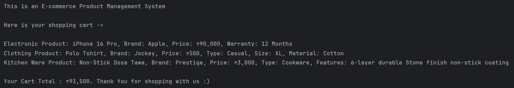

# E-commerce Product Management System

## *This project will demonstrate -*

- #### Encapsulation: Hiding data and methods within classes.
- #### Inheritance: Creating specialized classes based on general ones.
- #### Polymorphism: Using a single interface for different types of objects.
- #### Abstraction: Defining abstract classes or interfaces for common behavior.

### *Project Structure -*

├── src/  
│ ├── com/   
│ │ └── ecommerce/      
│ │ &nbsp;&nbsp;&nbsp;&nbsp;&nbsp;&nbsp;&nbsp;├── Product.java  
│ │ &nbsp;&nbsp;&nbsp;&nbsp;&nbsp;&nbsp;&nbsp;├── ElectronicProduct.java  
│ │ &nbsp;&nbsp;&nbsp;&nbsp;&nbsp;&nbsp;&nbsp;├── ClothingProduct.java  
│ │ &nbsp;&nbsp;&nbsp;&nbsp;&nbsp;&nbsp;&nbsp;├── ShoppingCart.java  
│ │ &nbsp;&nbsp;&nbsp;&nbsp;&nbsp;&nbsp;&nbsp;├── Main.java

### *OOPS Concepts Illustrated -*

- Encapsulation: The Product, ElectronicProduct, ClothingProduct, and ShoppingCart classes encapsulate their data (
  attributes) and methods.
  Access to data is controlled through getter methods.

- Inheritance: ElectronicProduct and ClothingProduct inherit from the Product class, inheriting common attributes and
  methods.
  They extend the base class with specialized attributes and behaviors.

- Polymorphism: The ShoppingCart's addItem method can accept any Product object (or subclass thereof).
  The toString() method is overriden in the child classes, changing the output of the object.

- Abstraction: The Product class is an abstract class, defining a common interface for all products.
  The getProductType() method is an abstract method, forcing the child classes to implement that method.

### *How to Run -*

- Create the project structure: Create the folder and package structure as shown above.
- Copy the code: Copy and paste the code into the corresponding .java files.
- Compile: Use a Java compiler (like javac) to compile the .java files.
- Run: Execute the Main class.
- This project provides a practical example of how to apply OOP principles in a real-world scenario. Remember to
  experiment and add more features to enhance your understanding.

### *Sample Output -*

